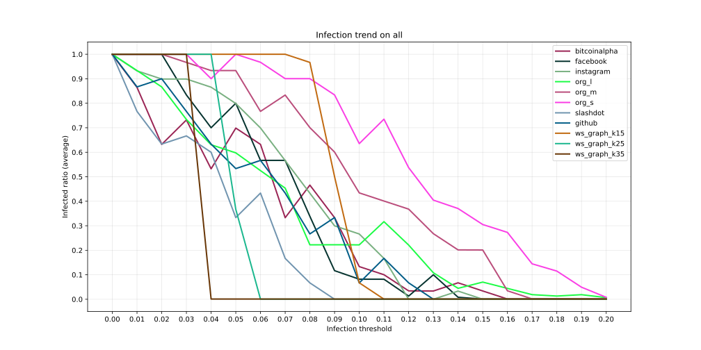
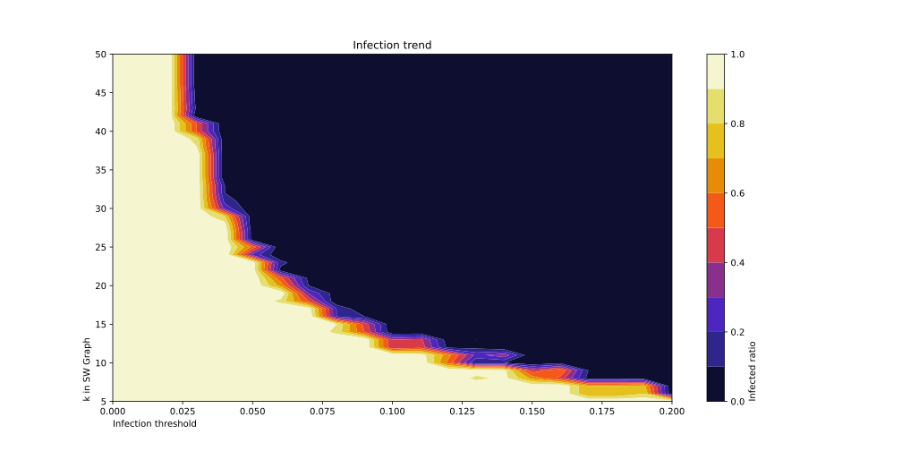

# 社群媒體概論期末報告

## 目的

探索謠言散播與社群網路的關係。

## 方法

**取得數據：**

   使用 Python Networkx 套件 `[附錄 2]` 產生 Watts-Strogatz network `[附錄 3]` 及載入真實世界的社群網路，
   並選取一個節點開始模擬謠言散播，其中「感染門檻」（Infection threshold）決定所有節點相信（感染）謠言的難度，
   對於任一節點，若鄰近節點相信謠言的比例大於感染門檻，則該節點相信此謠言，
   重複執行散播操作直到沒有新的節點被改變，最後取得「感染比例」（Infected ratio）。

**取得圖表：**

   使用 Python Matplotlib 套件 `[附錄 4]` 將足量感染門檻、感染比例數據繪製成折線圖以及熱點圖。

## 結果

1. 感染趨勢折線圖，橫軸為感染門檻（Infection threshold），縱軸為感染比例（Infected ratio）`[附錄 1.a]`：
> 

   > bitcoinalpha 資料來源: `[附錄 5.a]`

   > facebook 資料來源: `[附錄 5.b]`

   > instagram 資料來源: `[附錄 5.c]`

   > org_l 資料來源: `[附錄 5.d.1]`

   > org_m 資料來源: `[附錄 5.d.2]`

   > org_s 資料來源: `[附錄 5.d.3]`

   > slashdot 資料來源: `[附錄 5.e]`

   > github 資料來源: `[附錄 5.f]`

   > ws_graph_k15, ws_graph_k25, ws_graph_k35: Watts-Strogatz networks 其中 p = 0.3, 1000 個節點且 k 依序為 15, 25, 35。`[附錄 3]`

2. 感染趨勢熱點圖，X 軸為感染門檻（Infection threshold），Y 軸為 Watts-Strogatz networks 其中 p = 0.3, 1000 個節點的 k 值，Z 軸為感染比例（Infected ratio）`[附錄 1.b]`：
> 

3. 在 `[結果 1]` 中提到的所有網路的統計數據儲存在 output/stats_all.log：
```
bitcoinalpha
node_count: 3782
edge_count: 14123
avg_cluster: 0.1766757389650334
avg_degree: 7.46853516657853
density: 0.0019752803931707297

facebook
node_count: 4039
edge_count: 88233
avg_cluster: 0.6054912072684573
avg_degree: 43.69051745481555
density: 0.010819840875387704

instagram
node_count: 70409
edge_count: 865882
avg_cluster: 0.12830556164611326
avg_degree: 24.59577610816799
density: 0.00034933212288614917

org_l
node_count: 5793
edge_count: 30753
avg_cluster: 0.17068434742781244
avg_degree: 10.61729673744174
density: 0.0018330968124036153

org_m
node_count: 1429
edge_count: 19357
avg_cluster: 0.42115170748523817
avg_degree: 27.091672498250524
density: 0.01897175945255639

org_s
node_count: 320
edge_count: 2369
avg_cluster: 0.4926101751067942
avg_degree: 14.80625
density: 0.04641457680250784

slashdot
node_count: 77350
edge_count: 468554
avg_cluster: 0.05491253890371799
avg_degree: 12.115164835164835
density: 0.00015662988319389823

github
node_count: 37700
edge_count: 289003
avg_cluster: 0.16753704480107323
avg_degree: 15.331724137931035
density: 0.0004066878203117068

ws_graph_k15
node_count: 2500
edge_count: 17500
avg_cluster: 0.23931522342466696
avg_degree: 14.0
density: 0.0056022408963585435

ws_graph_k25
node_count: 2500
edge_count: 30000
avg_cluster: 0.2503860012627225
avg_degree: 24.0
density: 0.009603841536614645

ws_graph_k35
node_count: 1000
edge_count: 17000
avg_cluster: 0.2629787800476354
avg_degree: 34.0
density: 0.03403403403403404
```

   > node_count: 節點數量

   > edge_count: 邊數量

   > avg_cluster: 平均群聚係數

   > avg_degree: 平均度數

   > density: 密度

## 解釋

1. 從 `[結果 2]` 中可以看到 Watts-Strogatz network 的謠言散播趨勢，再熱點圖上產生了一條斷層，其圖形在 X-Y 軸上大致可連成 XY = 1 圖形，感染門檻與 k（平均分度 + 1）成反比，也就是門檻越高，使感染比率接近零需達到的鄰近感染率就要更高（得超過門檻才會感染）。

2. 從 `[結果 1]` 中可以看到真實世界的謠言散播趨勢，當感染門檻從 0.0 增加到 0.2，感染比例約皆從 1 平穩下降到 0，而其中真實世界網路平均度數的分佈從十幾到六十幾都有，與 [解釋 1] 觀察到的現象不太一樣，曲線沒有明顯的走向（除了 Watts-Strogatz 模型）。

## 附錄

1. 輸出:

   a. output/infection_all.svg

   b. output/ws_heatmap.csv & output/ws_heatmap.svg

2. [Networkx documentation](https://networkx.org/documentation/stable/reference/introduction.html)

3. [Watts-Strogatz network (Small-World network)](https://networkx.org/documentation/stable/reference/generated/networkx.generators.random_graphs.watts_strogatz_graph.html)

4. [Matplotlib documentation](https://matplotlib.org/stable/api)

5. 資料集:

   a. [Bitcoin Alpha network](https://www.kaggle.com/datasets/boneacrabonjac/bitcoin-alpha)

   b. [Facebook network - Socal graphs](https://www.kaggle.com/datasets/wolfram77/graphs-social)

   c. [Instagram network](https://www.kaggle.com/datasets/krpurba/im-instagram-70k)

   d. [Organizational network](https://www.kaggle.com/datasets/michaelfire/organizational-social-networks)

    1. [org_l](https://www.kaggle.com/datasets/michaelfire/organizational-social-networks?select=S1Anonymized.csv)
    2. [org_m](https://www.kaggle.com/datasets/michaelfire/organizational-social-networks?select=M1Anonymized.csv)
    3. [org_s](https://www.kaggle.com/datasets/michaelfire/organizational-social-networks?select=L1Anonymized.csv)

   e. [Slashdot network](https://www.kaggle.com/datasets/boneacrabonjac/slashdot)

   f. [Github network](https://www.kaggle.com/datasets/femikj/github-social-network)